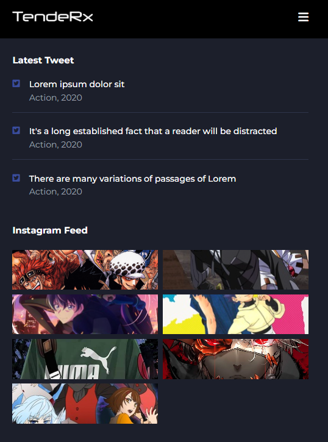

# Anime Website 

*I practiced flex in CSS and learned how can toggle menu when click to hamburger menu with this project. While I was developing this project I used querySelector, classList.add and remove functions in javascript*

*Also I used swiper@11 modules for swiper. I set breakpoints to add responsive feature*

*When it is scrolling, .scroll-header is added and background-color is changed*

>#
>* Built-with HTML5 , CSS and JavaScript
>* 100% Responsive Design
>#

## Images of the Project

